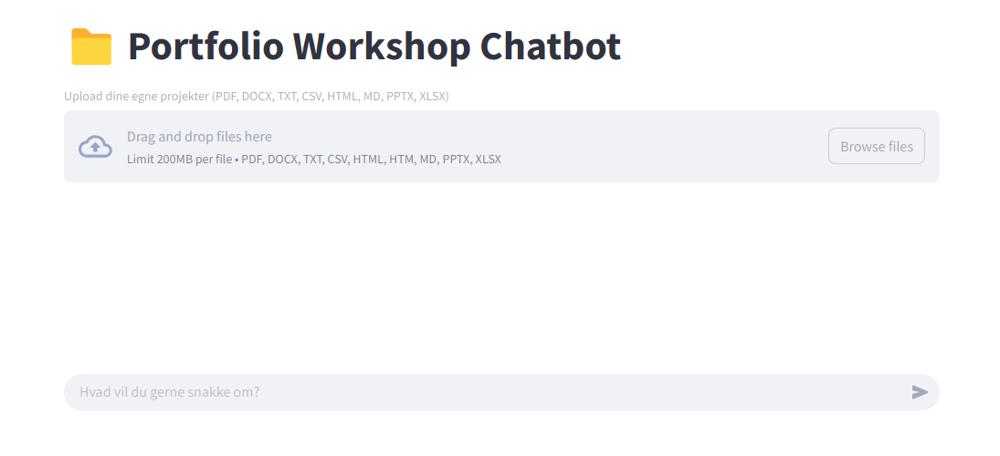

# 📁 PorteføljeBot

A simple chatbot that helps students reflect on their projects and build academic portfolios.  
Built with Streamlit and OpenAI's GPT-4o.

---



## ✅ Features

- 🧠 GPT-4o chatbot with a custom prompt focused on reflection and identity-building
- 📎 Upload your own project files:
  - PDF, DOCX, TXT, CSV, MD, PPTX, XLSX, HTML
- 🔍 Uses a shared vector store for reference material (e.g. example portfolios)
- 💬 Maintains full conversation memory within the session

---

## ⚙️ Setup

1. Clone the repo:
   ```bash
   git clone https://github.com/your-username/portefoljebot.git
   cd portefoljebot
   ```

2. Install dependencies:
   ```bash
   pip install -r requirements.txt
   ```

3. Create a `.streamlit/secrets.toml` file with your OpenAI API key, your custom prompt and login credentials:
   ```
   OPENAI_API_KEY=sk-...
   PROMPT_TEXT = """...
   LOGIN_USERNAME = ...
   LOGIN_PASSWORD = ...
   ```

4. Run the app:
   ```bash
   streamlit run app.py
   ```

## 📂 Project Structure

```
PortfolioBot/
├── src/
│   ├── .streamlit/         # Streamlit config and secrets
│   │   └── secrets.toml    # API key, custom prompt, login credentials
│   ├── app.py              # Streamlit UI (chat interface, login)
│   └── main.py             # Backend logic (file parsing, GPT calls)
│
├── image.png               # Optional visual asset (e.g. for docs)
├── .gitignore              # Ignore secrets, envs, cache, etc.
├── README.md               # Documentation
└── requirements.txt        # Python dependencies
```
---

## 🛠 Requirements

- Python 3.9+
- OpenAI Python SDK
- Streamlit
- PyPDF2, python-docx, python-pptx, openpyxl, beautifulsoup4

---

## 🔐 Notes

- Uploaded files are only used during the active chat session.
- Shared vector store data is static and anonymized.

